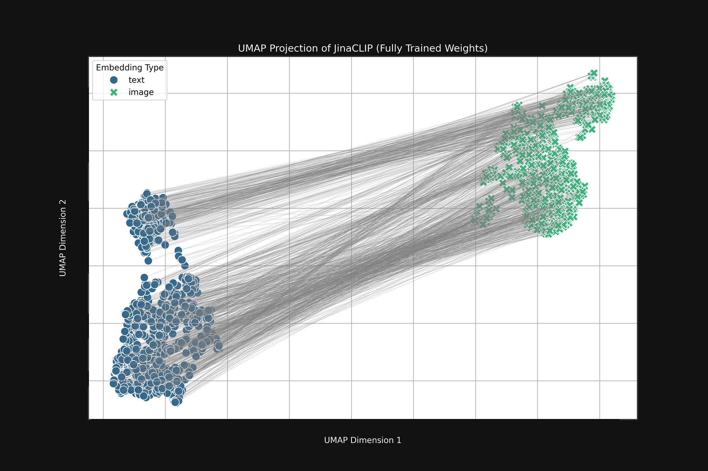

# Jina Embeddings v4: Backbone e Vision Encoder

## 🧠 Backbone

* Basata su **Qwen2.5‑VL‑3B‑Instruct** (3,8 mld di parametri)
* Transformer multimodale condiviso che riceve input testuali e visivi
* **Congelata** (frozen): durante il fine-tuning i pesi non cambiano
* Le specializzazioni vengono aggiunte mediante **adapter LoRA** (\~60 M parametri) ([arxiv.org](https://arxiv.org/pdf/2506.18902v3), [medium.com](https://medium.com/%40inturinikhilnageshwar/jina-embeddings-v4-one-model-to-embed-them-all-f78b8e53b925))

---

## 📷 Vision Encoder

* Preprocessa immagini fino a 20 MP
* Le suddivide in patch come nei ViT
* Ogni patch viene trasformata in un **token visivo vettoriale** con positional embedding
* I token sono concatenati ai token del testo e passano tutti insieme al transformer ([arxiv.org](https://arxiv.org/pdf/2506.18902v3), [medium.com](https://medium.com/%40inturinikhilnageshwar/jina-embeddings-v4-one-model-to-embed-them-all-f78b8e53b925))

---

## 🎯 Token visivi

* Rappresentano patch come token, analoghi alle parole nel testo
* Producono una sequenza comune di token visivi + testuali per il transformer
* Output in due modalità:

  * **Single-vector**: mean pooling → vettore 2048‑dim (truncabile via Matryoshka)
  * **Multi-vector**: 128‑dim per token, perfetti per retrieval a late‑interaction

---

## 📏 Modality Gap



* Nei modelli dual‑encoder (es. CLIP), immagini e testo generano embedding in distinte "conde" nello spazio latente
* Il gap è visibile nei plot UMAP con due cluster separati, come nei grafici sopra ([arxiv.org][1], [arxiv.org][2], [medium.com][3], [emergentmind.com][4], [arxiv.org][5], [jina.ai][6])
* La distribuzione di similarità mostra che testo–testo (arancione) ha valori medio‑alti (\~0.6‑0.8), mentre immagine–testo (blu) ha valori bassi (\~0.3)&#x20;
* Questo fenomeno è causato da:

  1. **Cone effect**: all’inizializzazione, i token occupano regioni separate ([arxiv.org][2])
  2. **Ottimizzazione contrastiva**: mantiene le modalità distinte, limitando l’allineamento semantico ([arxiv.org][1])

---

## ✅ Come Jina Embeddings v4 risolve il problema

* Utilizza un **unico flusso transformer** per testo e immagine (single-stream), eliminando la separazione tra modalità&#x20;
* La **somiglianza media tra immagini e testi** su dataset benchmark sale a \~0.71 (vs \~0.15 in CLIP) ([jina.ai][7])
* L’**allineamento cross-modal** risulta molto più forte: le embedding money sono significativamente più vicine nello spazio semantico

---

### 🔄 Pipeline riassuntiva

```text
Immagine → Vision Encoder → Token visivi
         Token testuali → Transformer (shared backbone)
              ↓
       Single-vector o Multi-vector
```

---

## 🎯 In sintesi

* **Backbone**: Qwen2.5‑VL multimodale, frozen
* **Vision encoder**: trasforma l’immagine in token visivi
* **Token visivi**: trattati come token testuali
* **Modality gap**: ridotto drasticamente grazie alla pipeline unificata
* **Risultato**: embedding semanticamente allineati, perfetti per retrieval cross-modal

---

[1]: https://arxiv.org/abs/2203.02053?utm_source=chatgpt.com "Mind the Gap: Understanding the Modality Gap in Multi-modal Contrastive Representation Learning"
[2]: https://arxiv.org/pdf/2506.18902?utm_source=chatgpt.com "[PDF] Universal Embeddings for Multimodal Multilingual Retrieval - arXiv"
[3]: https://medium.com/%40inturinikhilnageshwar/jina-embeddings-v4-one-model-to-embed-them-all-f78b8e53b925?utm_source=chatgpt.com "Jina Embeddings v4: One Model to Embed Them All - Medium"
[4]: https://www.emergentmind.com/papers/2506.18902?utm_source=chatgpt.com "Jina-Embeddings-v4: Universal Retrieval - Emergent Mind"
[5]: https://arxiv.org/html/2506.18902v2?utm_source=chatgpt.com "Universal Embeddings for Multimodal Multilingual Retrieval - arXiv"
[6]: https://jina.ai/news/the-what-and-why-of-text-image-modality-gap-in-clip-models/?utm_source=chatgpt.com "The What and Why of Text-Image Modality Gap in CLIP Models"
[7]: https://jina.ai/models/jina-embeddings-v4/?utm_source=chatgpt.com "jina-embeddings-v4 - Search Foundation Models - Jina AI"
